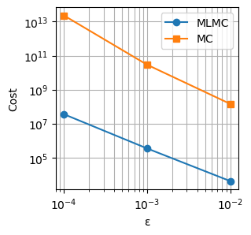
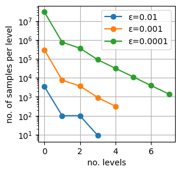

# MLMC Implementation in Rust
This repository contains a **Rust implementation of the Multilevel Monte Carlo (MLMC) method** for solving stochastic differential equations (SDEs). It supports adaptive level selection, variance estimation, and linear regression to determine MLMC parameters.




## Features

- Simulates customizable SDEs.
- Computes MLMC estimators up to a specified tolerance `ε`.  
- Automatically estimates convergence rates via linear regression.  
- Outputs both **MLMC** and **standard Monte Carlo (MC)** costs.  

## Usage

1. Clone the repository:

```bash
git clone <repo_url>
cd <repo_dir>
cargo run
```

